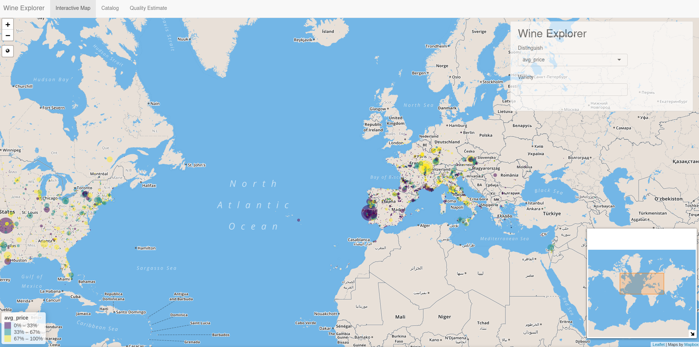

# Wine App

## Running the Application

The production version of the application is deployed at: https://szablah.shinyapps.io/wine/

You can run the repository's HEAD app with the following command:  

```R
shiny::runGitHub("wine_app", "shukryzablah", subdir = "app/")
```

Or you can follow our progress at: https://github.com/shukryzablah/wine_app

A full report is available [in this repository's index/book folder](./index/_book/finalreport.pdf)

## Screenshots

1. Our application has a fully interactive map of the world with different inputs to search and find out more about the mapped wineries in the dataset.



2. We provide a fully searchable catalog of our dataset with fuzzy matching as well as the ability to locate observations in the map.


3. We also provide a prediction engine powered by our boosting model to predict the score of wines from user input.


## Team

- Shukry Zablah (shukryzablah.com)
- Emily Ye
